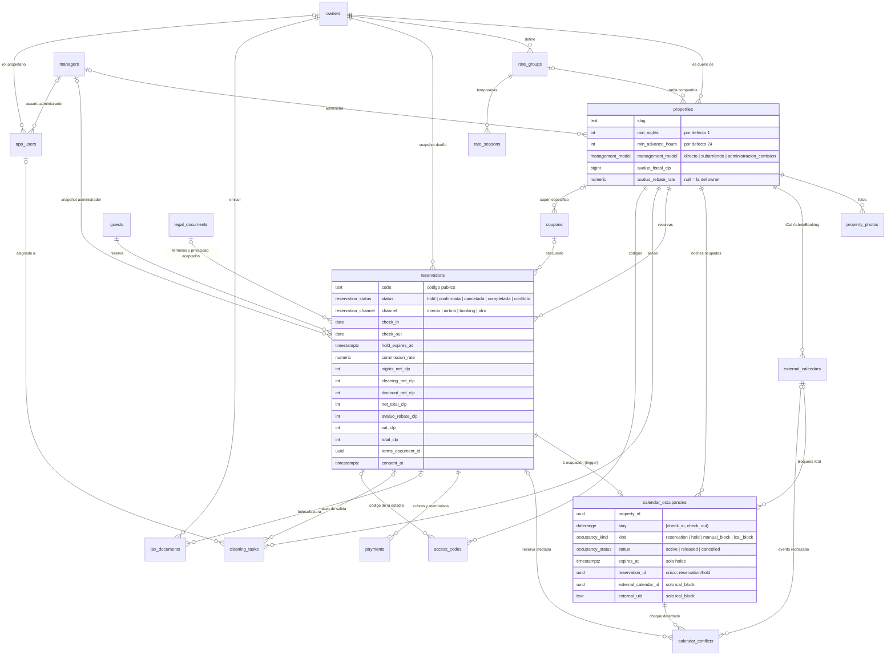

# Modelo de datos

Esquema creado en la Sesión 2 (`supabase/migrations/20261007150001` a `…150005`) y permisos por rol en la Sesión 3 (`…160001` a `…160006`). Todas las tablas viven en el esquema `public` y tienen **RLS activado**. Ver [Permisos por rol](#permisos-por-rol).

Convenciones: ids `uuid`; dinero en `integer` CLP (sufijo `_clp`, IVA incluido solo donde dice); tasas en `numeric(5,4)` (decimal exacto); estadías en `date` con intervalo **[check_in, check_out)**; momentos en `timestamptz`; `updated_at` mantenido por el trigger `set_updated_at()`.

## Diagrama entidad-relación



Tablas: `owners`, `managers`, `properties`, `property_photos`, `rate_groups`, `rate_seasons`, `calendar_occupancies`, `calendar_conflicts`, `external_calendars`, `guests`, `reservations`, `payments`, `tax_documents`, `cleaning_tasks`, `access_codes`, `message_templates`, `coupons`, `app_users`, `legal_documents` y `app_settings` (Sesión 1).

## Regla anti-doble-reserva

Todo lo que ocupa noches vive en **una sola tabla**, `calendar_occupancies`: reservas, holds de pago, bloqueos manuales e imports iCal. La restricción

```sql
exclude using gist (property_id with =, stay with &&) where (status = 'active')
```

hace **imposible** guardar dos ocupaciones activas de la misma propiedad que compartan una noche, sin importar de dónde vengan ni si llegan al mismo tiempo. Como `stay` es `[check_in, check_out)`, una salida y una llegada el mismo día no chocan.

Otras garantías de la tabla:
- `hold` exige `expires_at`; `reservation`/`hold` exigen `reservation_id` (y los demás tipos no lo tienen); `ical_block` exige calendario y `external_uid`.
- El rango no puede estar vacío ni ser abierto.
- `(external_calendar_id, external_uid)` es único entre las activas: el import iCal (Sesión 8) es idempotente.

Otras tablas con exclusión: `rate_seasons` (no hay temporadas solapadas en un mismo grupo de tarifa).

## Ciclo de vida reserva → ocupación

La ocupación de una reserva **no se escribe a mano**: la mantiene el trigger `reservations_sync_occupancy` (función `sync_reservation_occupancy`).

| Cambio en `reservations` | Efecto en `calendar_occupancies` |
|---|---|
| INSERT con `status = hold` | Crea ocupación `hold` activa con `expires_at = hold_expires_at`. Si las noches no están libres, **falla toda la inserción**. |
| INSERT con `confirmada` | Crea ocupación `reservation` activa. |
| `hold` → `confirmada` | Actualiza la **misma fila** a `reservation` sin vencimiento: no existe un instante en que las noches queden libres. |
| Cambio de fechas o propiedad | Actualiza `stay`; la restricción se vuelve a validar. |
| → `cancelada` (motivo `hold_expirado`) | Ocupación `released`. |
| → `cancelada` (otro motivo) | Ocupación `cancelled`. |
| → `conflicto` o `completada` | La ocupación sigue `active` (las noches siguen vendidas). |

**Seguridad de los triggers.** `sync_reservation_occupancy`, `release_expired_holds` y `register_calendar_conflict` son `SECURITY DEFINER`, con `set search_path = ''` y `execute` revocado a `public`, `anon` y `authenticated`. Así, en la Sesión 3 **ningún rol de cliente tendrá escritura directa** sobre `calendar_occupancies` para ocupaciones `reservation`/`hold`: solo se crean y cambian a través de `reservations` (y, en sesiones posteriores, de funciones del servidor). Los bloqueos manuales los creará el panel con permisos acotados a `manual_block`.

## Liberación de holds vencidos (pg_cron)

- Job `release-expired-holds`, cada minuto (`* * * * *`), ejecuta `select public.release_expired_holds()`.
- La función pasa a `cancelada` (motivo `hold_expirado`) cada reserva en `hold` con `hold_expires_at < now()`; el trigger libera su ocupación (`released`). Devuelve cuántas liberó.
- **Pago en curso:** no libera un hold que tenga un `payments` de tipo `cobro` en estado `pendiente` creado hace menos de `hold_payment_grace_minutes` minutos (fila no pública de `app_settings`, valor inicial `30`; si falta o no es un número, se usa 30). Ese hold se libera cuando el pago cambia de estado (por ejemplo `rechazado`) o cuando vence el margen.
- Entre el vencimiento y la siguiente ejecución (máximo ~1 minuto) el hold **sigue bloqueando**: el error posible es siempre hacia el lado seguro.

### Cómo verificar que el job corre

```sql
-- ¿Existe y está activo?
select jobid, jobname, schedule, active from cron.job where jobname = 'release-expired-holds';

-- Últimas ejecuciones (deben aparecer cada minuto con status 'succeeded')
select start_time, status, return_message
  from cron.job_run_details
 where jobid = (select jobid from cron.job where jobname = 'release-expired-holds')
 order by start_time desc
 limit 5;
```

Se ejecutan con `npx supabase db query --linked "<sql>"`. En la Sesión 2 además se hizo una prueba real: un hold que vencía en 1 minuto quedó `cancelada / hold_expirado` y su ocupación `released` sin intervención (ver BITACORA.md).

## Protocolo de conflicto

Caso: el import iCal trae un evento de Airbnb/Booking que choca con una ocupación existente (por ejemplo, una reserva directa ya pagada). La restricción impide insertarlo (error `23P01`), así que el import (Sesión 8) debe llamar a:

```sql
select public.register_calendar_conflict(external_calendar_id, external_uid, stay, resumen);
```

que:
1. Registra en `calendar_conflicts` un choque por cada ocupación activa solapada (evento rechazado, rango, ocupación y reserva afectadas, `detected_at`). Si el mismo choque ya está abierto (`resolved_at is null`) no lo duplica: el import puede correr cada 10–15 minutos sin repetir avisos.
2. Pasa a `conflicto` las reservas **confirmadas** afectadas. Su ocupación sigue activa: las noches siguen vendidas y no se pueden volver a vender.
3. Un hold sin pagar afectado queda registrado en `calendar_conflicts` pero no cambia de estado; la Sesión 9/10 lo revalida antes de cobrar.

Pendiente: aviso inmediato a René (`notified_at`, Sesión 11) y reembolso según la política (Sesiones 10 y 15). `resolved_at` y `resolution` registran cómo se cerró.

## Permisos por rol

Sesión 3 (`supabase/migrations/20261007160001` a `…160006`). Probado con `supabase/tests/role_permissions.sql` (92 casos).

### Roles y cómo se reconocen

| Rol | Rol de base de datos | Cómo se identifica |
|---|---|---|
| Público | `anon` | Sin sesión. |
| Autenticado sin perfil | `authenticated` | Tiene sesión pero no tiene fila activa en `app_users`: **no coincide con ninguna política**, ve solo lo mismo que el público. |
| admin | `authenticated` | `app_users.role = 'admin'` (René, cargado por la migración `…160006`). |
| encargado | `authenticated` | `app_users.role = 'encargado'`. |
| propietario | `authenticated` | `app_users.role = 'propietario'` + `owner_id`. |

Funciones auxiliares (`SECURITY DEFINER`, `STABLE`, `search_path = ''`, `execute` solo para `authenticated`): `current_app_role()`, `is_admin()`, `is_staff()` (admin o encargado), `current_owner_id()`. Leen `app_users` por `auth.uid()` y solo si `is_active`.

### Decisión: vistas de columnas fijas

Admin, encargado y propietario comparten el rol `authenticated`, así que un permiso por columna afectaría a todos. Por eso lo parcial se expone con **vistas** que corren con permisos de su dueño (`security_invoker = false`), filtran por estado y rol en su `WHERE` y llevan `security_barrier = true` (los filtros del cliente no pueden ver filas excluidas). El público **no tiene ningún permiso sobre las tablas base** (salvo `app_settings`, que ya filtra por `is_public`). Una columna nueva nunca se expone sola. El asesor de Supabase marca estas vistas como "security definer view": es intencional.

### Qué puede hacer cada rol

| Recurso | Público | Sin perfil | Encargado | Propietario | Admin |
|---|---|---|---|---|---|
| `public_properties` (sin dirección, avalúo, owner ni datos tributarios; solo `publicada`) | lee | lee | lee | lee | lee |
| `public_property_photos`, `public_legal_documents` (publicados) | lee | lee | lee | lee | lee |
| `get_property_availability(slug, desde, hasta)` | ejecuta | ejecuta | ejecuta | ejecuta | ejecuta |
| `app_settings` | filas públicas | filas públicas | filas públicas | filas públicas | todo |
| `properties` (tabla) | — | — | — | sus propiedades (lectura) | todo |
| `staff_properties` (con dirección, sin datos tributarios) | — | — | lee | — | lee |
| `staff_reservations` (confirmada, completada y conflicto; futuras y últimos 7 días; nombre y teléfono del huésped; sin email, documento ni montos) | — | — | lee | — | lee |
| `staff_access_codes` (vigentes o próximos de reservas confirmadas o en conflicto) | — | — | lee | — | lee |
| `cleaning_tasks` | — | — | lee y actualiza estado, notas y término | — | todo |
| `owner_reservations` (sus reservas, sin datos del huésped, con montos y comisión) | — | — | — | lee | — |
| `owner_revenue_summary` (por propiedad y mes; confirmadas y completadas) | — | — | — | lee | — |
| `reservations`, `payments`, `tax_documents` | — | — | — | — | lee, crea, actualiza (**no borra**: se cancela o anula) |
| `calendar_occupancies` | — | — | — | — | **solo lee** |
| `create_manual_block` / `remove_manual_block` | — | — | — | — | ejecuta |
| `calendar_conflicts` | — | — | — | — | lee y marca resuelto |
| Resto de tablas (`owners`, `guests`, `coupons`, `rate_*`, `app_users`, etc.) | — | — | solo su fila de `app_users` | solo su fila de `app_users` | todo |
| Storage `property-photos` | lee por URL pública | lee por URL pública | lee por URL pública | lee por URL pública | sube, modifica, borra, lista |

### Detalles

- **Disponibilidad pública:** `get_property_availability` devuelve solo `(start_date, end_date)` con `end_date` exclusivo (día de salida libre), une rangos contiguos con `range_agg` para no revelar cuántas reservas hay, su tipo ni su canal, solo para propiedades `publicada` y con ventana máxima de 18 meses.
- **Ocupaciones:** ningún rol de cliente escribe directo en `calendar_occupancies`. Las de reservas las mantiene el trigger de `reservations`; los bloqueos manuales, `create_manual_block` (respeta la restricción anti-doble-reserva: si choca, error `23P01`) y `remove_manual_block` (no borra: deja `cancelled`); los iCal, el import del servidor (Sesión 8).
- **Encargado y aseos:** RLS le permite `update`; el trigger `cleaning_tasks_restrict_staff_update` rechaza cualquier cambio de propiedad, reserva, fecha o asignación si quien actualiza es encargado.
- **Último admin:** el trigger `app_users_protect_last_admin` impide quitar el rol, desactivar o borrar al último admin activo.
- **Storage:** bucket `property-photos` **público** (decisión de René: caché/CDN, SEO de imágenes y vista previa al compartir por WhatsApp). Cualquiera con la URL lee cualquier archivo del bucket, incluso de una propiedad en borrador: **las fotos de propiedades en borrador no se consideran sensibles**. Escritura y listado solo con `is_admin()`. Límite 10 MB; JPEG, PNG, WebP o AVIF. Ruta: `<property_id>/<archivo>`.
- **Endurecimiento:** `set_updated_at()` y `rls_auto_enable()` (event trigger `ensure_rls` de Supabase) sin `execute` para `public`, `anon` ni `authenticated`. Se probó que el RLS automático sigue funcionando: una tabla creada después del revoke (en una transacción revertida) nació con RLS.
- **Registro público:** desactivado en Supabase Auth (verificado: `disable_signup: true` y un intento de registro devuelve `signup_disabled`). Aunque se reactivara, un usuario nuevo no tiene fila en `app_users` y no ve nada privado.
- **Barrido de exposición:** lo único que `anon` puede leer en `public` es `app_settings` (filas públicas) y las 3 vistas `public_*`; la única función que puede ejecutar es `get_property_availability`. Ninguna columna de dirección, avalúo, RUT, owner, IVA, modelo tributario, email, teléfono ni documento le es accesible.

## Datos reales

Carga, decisiones de precio (tarifas con IVA) y procedimiento para completar datos: [docs/datos-reales.md](datos-reales.md). Fotos: [docs/fotos.md](fotos.md).

## Pendientes para sesiones siguientes

- **Sesión 5 (inicio y listado):** el frontend lee `public_properties`, `public_property_photos` (URL pública del bucket) y `get_property_availability`; nunca las tablas base.
- **Sesión 7 (motor de precios):** exponer al público un **"precio desde" por noche, con IVA incluido**, calculado por el motor de precios (por ejemplo, una columna en `public_properties` o una función pública), sin revelar el desglose interno.
- **Sesión 10 (pagos):** un webhook de pago que llega para un hold **ya liberado** debe reconfirmar si las fechas siguen libres (volver a `confirmada` reactiva la misma ocupación y la restricción lo valida) o, si no lo están, marcar la reserva para **reembolso automático**. Una reserva en `conflicto` que recibe pago también va a reembolso. Tabla de eventos de webhook para idempotencia.
- **Sesión 8 (iCal):** usar `occupancies_external_uid_idx` para upsert de eventos y `register_calendar_conflict` ante `23P01`.

## Pruebas

`supabase/tests/anti_double_booking.sql` (ver [supabase/tests/README.md](../supabase/tests/README.md)): 22 casos dentro de una transacción con `ROLLBACK`, contra la base remota y sin dejar datos.
